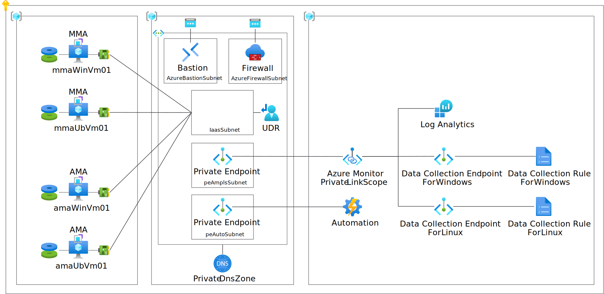

# azure-private-ops-lab-generator

This repository is the sample Bicep files for creating the environment which you can evaluate Azure Monitor Agent(AMA) and Microsoft Monitoring Agent(MMA) in. Each Agents connect to Log Analytics through Private Endpoint.

This bicep creates the following resources.

# Usage
1. Clone this repository
1. Edit `param.json.template` and change a file name from `param.json.template` to `param.json`
1. Deploy this template into subscription by using a command like `New-AzSubscriptionDeployment`

# Parameters

|Parameter|Meaning|
|---|---|
|envLocation| The location which you can deploy these resources|
|adminUername| The username of test VMs|
|adminPassword| The password of test VMs|